# MediCare Connect — Healthcare Appointment Booking Platform

A professional healthcare appointment booking platform built with React, TypeScript, Vite, Tailwind CSS, Zustand, Recharts, Lucide React, React Hot Toast, date-fns, and role-based dashboards.

MediCare Connect includes doctor search, doctor profile pages, appointment booking, patient dashboard, doctor schedule management, prescription UI, medical records, payment/status pages, notifications, admin analytics, and responsive healthcare-focused UI.

## Demo Accounts

### Patient

```text
Email: patient@medicare.com
Password: demo123
```

### Doctor

```text
Email: doctor@medicare.com
Password: demo123
```

### Admin

```text
Email: admin@medicare.com
Password: demo123
```

---

## Project Overview

**MediCare Connect** is a modern healthcare appointment booking platform where patients can search doctors, view doctor profiles, book appointments, manage prescriptions, upload/view medical records, track payments, and receive appointment notifications.

The platform also includes dedicated dashboards for doctors and admins. Doctors can manage appointments, calendars, patient lists, prescriptions, schedules, and reviews. Admins can manage doctors, patients, appointments, departments, payments, reports, and platform settings.

This project is designed to demonstrate professional frontend architecture, role-based routing, healthcare workflow design, dashboards, appointment logic, calendar UI, prescription UI, analytics, and responsive product design.

---

## Features

### Public Website

- Home page
- Doctors listing page
- Doctor details/profile page
- Departments page
- Services page
- Pricing page
- About page
- FAQ page
- Contact page
- Doctor search and filtering UI
- Department cards
- Featured doctors
- Healthcare services section
- Emergency/contact CTA
- Responsive public layout

### Authentication

- Login UI
- Register UI
- Forgot password UI
- Demo account login
- Role-based routing
- Protected dashboard routes
- LocalStorage session persistence
- Logout functionality

### Patient Experience

- Patient dashboard
- Book appointment flow
- My appointments page
- Appointment status tracking
- Prescriptions page
- Medical records page
- Favorite doctors page
- Payments/status page
- Notifications page
- Patient settings page

### Doctor Experience

- Doctor dashboard
- Appointments management
- Appointment calendar
- Patient list
- Prescription writer
- Schedule management
- Reviews page
- Notifications page
- Doctor settings page
- Appointment status update UI

### Admin Experience

- Admin dashboard analytics
- Doctors management
- Patients management
- Appointments management
- Departments management
- Payments overview
- Reports page
- Platform settings
- Doctor/patient/appointment table UI
- Healthcare analytics charts

### Healthcare-Specific Features

- Doctor search
- Doctor profile
- Appointment booking
- Appointment calendar
- Appointment status management
- Payment status management
- Prescription UI
- Medical record cards
- Patient/doctor/admin role system
- Department-wise analytics
- Healthcare notification flow

### Frontend Skills Demonstrated

- React Router routing
- Role-based UI
- Protected routes
- Zustand state management
- Recharts analytics
- Dark/light mode
- Responsive layout
- Dashboard UI architecture
- Tables and cards
- Form-style appointment booking
- Calendar-style schedule UI
- LocalStorage persistence
- Professional healthcare-focused product design

---

## Tech Stack

- React
- TypeScript
- Vite
- Tailwind CSS
- React Router DOM
- Zustand
- Recharts
- Lucide React
- React Hot Toast
- date-fns
- Framer Motion-ready structure

---

## Screenshots

### Homepage

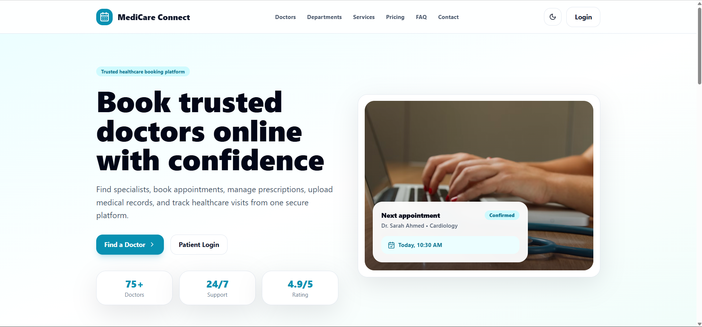

### Doctors Page

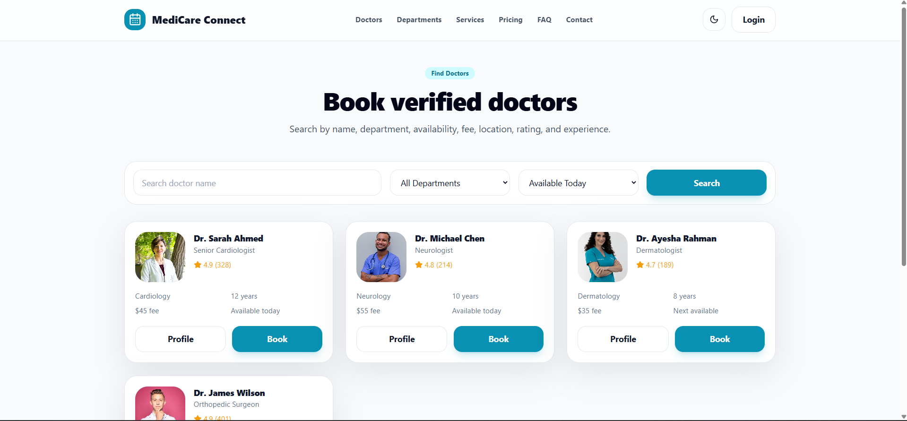

### Doctor Profile

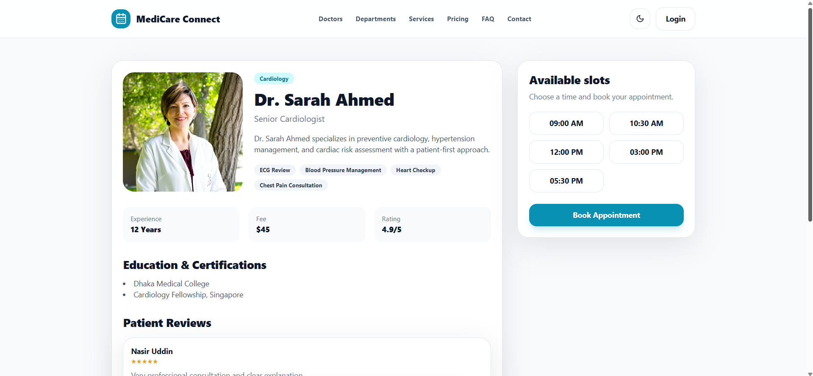

### Appointment Booking

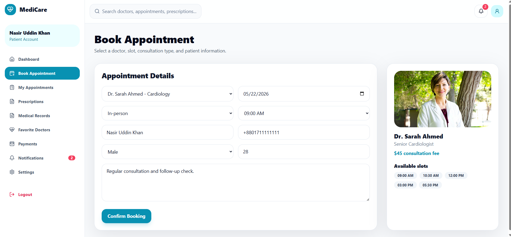

### Patient Dashboard

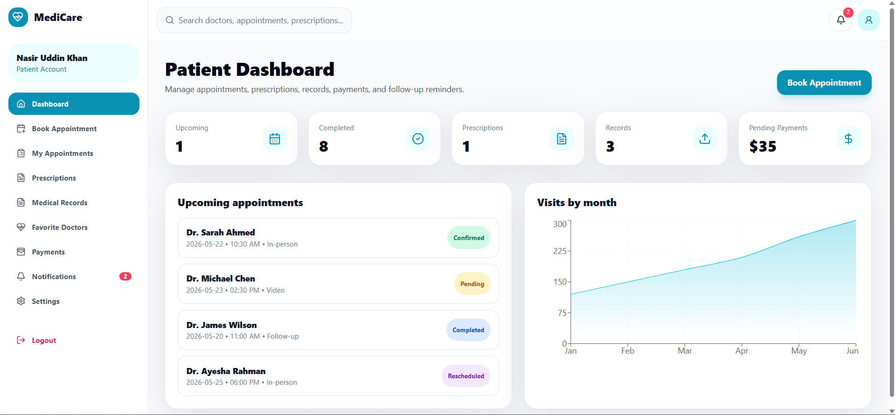

### Doctor Dashboard

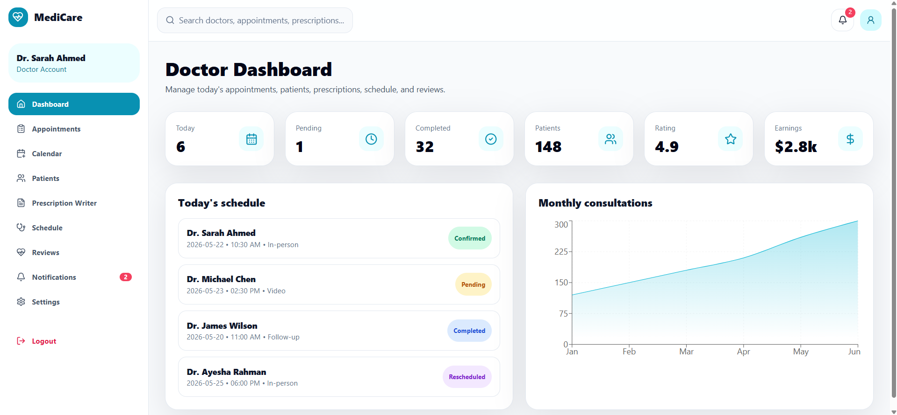

### Prescription Writer

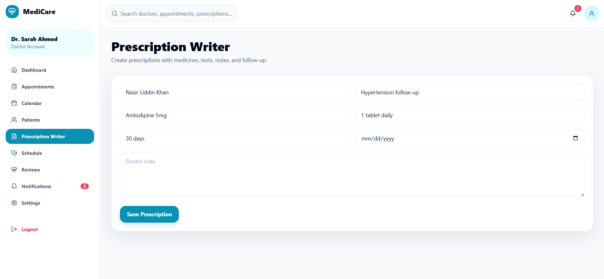

### Admin Dashboard

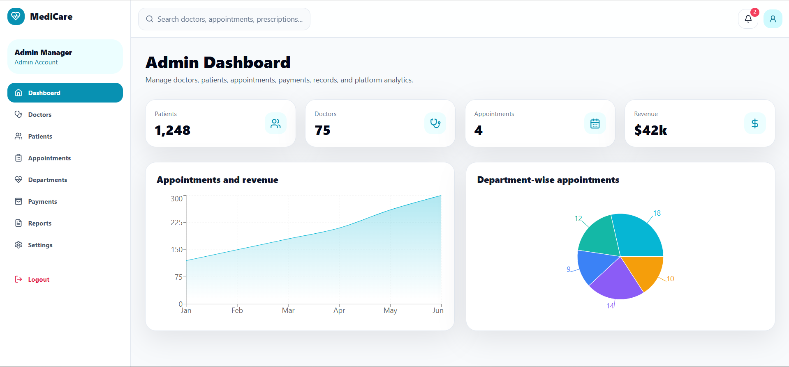

### Reports Page

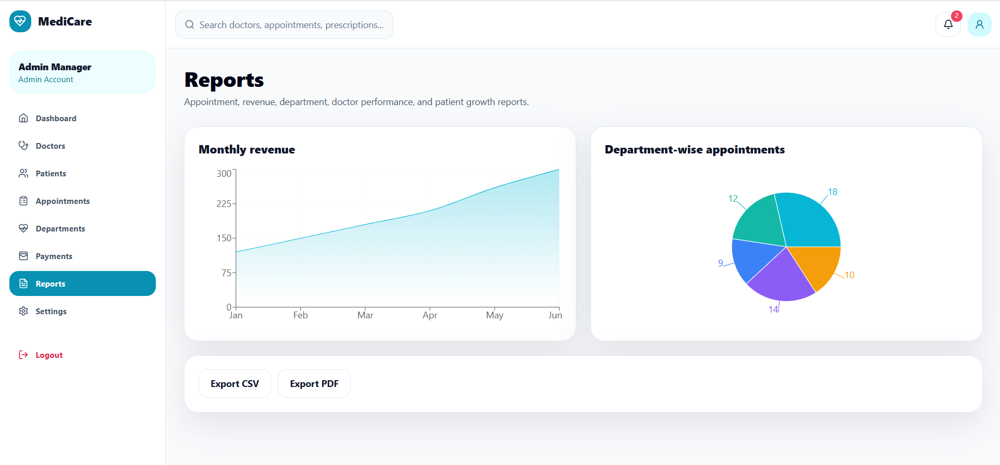

### Mobile View

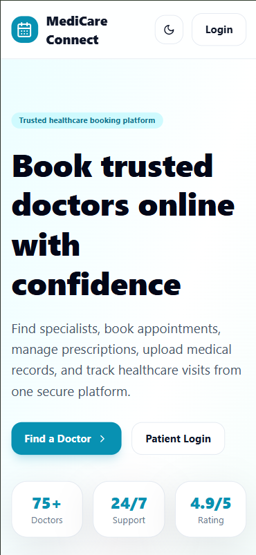

### Tablet View

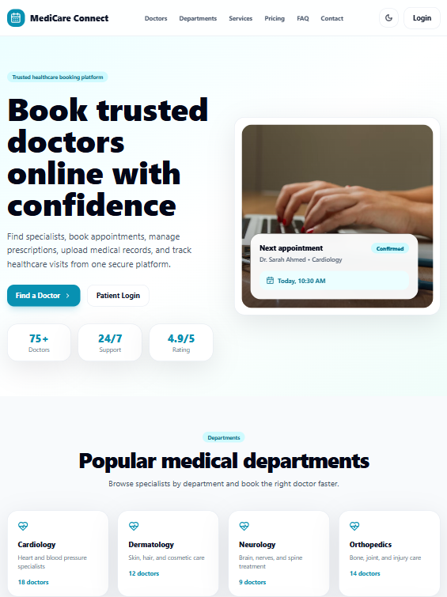

---

## Installation

Clone the repository:

```bash
git clone https://github.com/nasir050298/medicare-appointment-booking-platform.git
```

Go to the project folder:

```bash
cd medicare-appointment-booking-platform
```

Install dependencies:

```bash
npm install
```

Run the development server:

```bash
npm run dev
```

Local URL usually:

```text
http://localhost:5173
```

---

## Build

Create production build:

```bash
npm run build
```

Preview production build locally:

```bash
npm run preview
```

---

## Folder Structure

```text
src/
├── components/
│   ├── ui/
│   ├── layout/
│   ├── landing/
│   ├── doctor/
│   ├── appointment/
│   ├── patient/
│   ├── prescription/
│   ├── admin/
│   ├── charts/
│   └── modals/
├── data/
├── hooks/
├── pages/
│   ├── public/
│   ├── auth/
│   ├── patient/
│   ├── doctor/
│   └── admin/
├── routes/
├── store/
├── types/
├── utils/
├── App.tsx
└── main.tsx
```

---

## Main Pages

### Public Pages

- Home
- Doctors
- Doctor Details
- Departments
- Services
- Pricing
- About
- FAQ
- Contact
- Login
- Register
- Forgot Password

### Patient Pages

- Patient Dashboard
- Book Appointment
- My Appointments
- Prescriptions
- Medical Records
- Favorite Doctors
- Payments
- Notifications
- Settings

### Doctor Pages

- Doctor Dashboard
- Appointments
- Appointment Calendar
- Patient List
- Prescription Writer
- Schedule Management
- Reviews
- Notifications
- Settings

### Admin Pages

- Admin Dashboard
- Doctors Management
- Patients Management
- Appointments Management
- Departments Management
- Payments
- Reports
- Settings

---

## Future Improvements

- Node.js/Express backend
- MongoDB/PostgreSQL database
- JWT authentication
- Cloudinary/S3 file storage
- Stripe or SSLCommerz payment integration
- FullCalendar integration
- PDF prescription generation
- Real-time appointment updates with Socket.IO
- Doctor approval workflow
- Patient medical history backend
- Email/SMS appointment reminders
- Video consultation integration
- Multi-language support

---

## Author

**Nasir Uddin Khan**

GitHub: [nasir050298](https://github.com/nasir050298)

---

## License

This project is created for portfolio, learning, and frontend showcase purposes. You can customize it for your own healthcare appointment platform.
